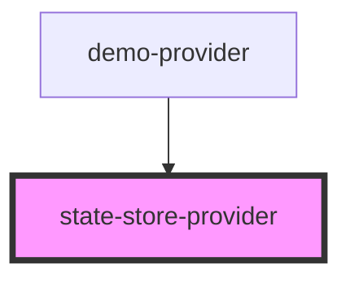

# state-store-provider

<!-- Auto Generated Below -->

## Properties

| Property                | Attribute  | Description | Type  | Default     |
| ----------------------- | ---------- | ----------- | ----- | ----------- |
| `provider` _(required)_ | `provider` |             | `any` | `undefined` |

## Events

| Event                                  | Description | Type               |
| -------------------------------------- | ----------- | ------------------ |
| `@runopencode:store:provider:register` |             | `CustomEvent<any>` |

## Dependencies

### Used by

 - [demo-provider](../demo)

### Graph

----------------------------------------------

*Built with [StencilJS](https://stenciljs.com/)*
